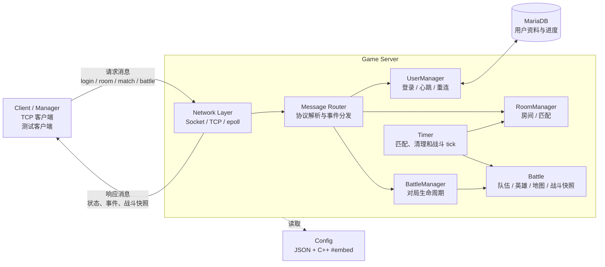

# Game Server Dev

一个基于 C++26 Modules、Linux `epoll` 和 MariaDB 的多人对战游戏服务器练习项目。

项目重点不是客户端画面，而是服务端核心链路：

- 用户登录与心跳
- 房间创建、邀请、聊天和离开
- 房间匹配、确认、拒绝和超时取消
- 英雄选择、加载和战斗状态同步
- 移动、普通攻击、技能释放和战斗快照
- 断线重连基础流程

## 当前状态

当前项目已经具备可运行的服务端主链路。登录、建房、邀请入房等流程可以通过仓库中的 `manager` 集成测试验证。

目前仍属于开发中的项目，以下功能还需要继续完善：

- `GroundEffects` 已有数据结构、序列化和战斗 tick 处理，但技能释放链路尚未完全接入。
- `BattleResult` 和完整对局结算尚未实现。
- 重连测试脚本和测试程序的命令集还没有完全对齐。
- CTest 尚未注册测试，当前测试通过 `manager` 程序执行。

## 技术结构




## 主要目录：

| 目录 | 内容 |
|------|------|
| `src/server` | 服务端入口、事件分发和服务器配置 |
| `src/net` | TCP、Socket 和 epoll 封装 |
| `src/user` | 用户、在线状态和断线重连 |
| `src/room` | 房间、匹配树和待确认匹配 |
| `src/battle` | 对局、队伍、地图和战斗快照 |
| `src/heros` | 英雄、技能效果和地面效果 |
| `src/db` | MariaDB 连接和 prepared statement |
| `tests` | 测试客户端、manager 和测试脚本 |
| `script` | MariaDB、Redis 和测试用户管理脚本 |

## 构建依赖

项目使用了较新的 C++ 特性，当前构建依赖支持以下能力的 GCC trunk：

- C++26 Modules
- `#embed`
- `-freflection`
- `import std`

还需要：

- CMake 4.3+
- Ninja
- MariaDB Connector/C
- hiredis
- redis-plus-plus
- OpenSSL
- nlohmann-json

当前 CMake 会通过 `find_package(nlohmann_json REQUIRED CONFIG)` 查找 nlohmann-json，并手动查找 MariaDB、hiredis 和 redis-plus-plus。

## 配置

配置文件位于：

```text
src/server/server_config.json
```

当前配置示例：

```json
{
    "server_config": {
        "server_listen_ip": "0.0.0.0",
        "server_listen_port": 8080
    },
    "database_config": {
        "user": "root",
        "password": "123456",
        "host": "localhost",
        "port": 3306,
        "name": "game"
    }
}
```

配置通过 C++ `#embed` 在编译期嵌入程序，因此：

1. 修改 `server_config.json` 后必须重新编译。
2. 修改配置不会影响已经生成的旧二进制。
3. 真实环境不应把数据库密码直接提交到仓库，建议改用环境变量或独立的本地配置文件。

## 构建

将 `/path/to/gcc-trunk/bin/g++` 替换为本机支持上述 C++ 特性的 GCC 路径：

```bash
cmake -S . -B build -G Ninja \
    -DCMAKE_CXX_COMPILER=/path/to/gcc-trunk/bin/g++ \
    -DCMAKE_C_COMPILER=/path/to/gcc-trunk/bin/gcc

cmake --build build -j2
```

构建产物：

```text
build/game-server-dev
build/manager
```

如果运行时找不到 GCC trunk 对应的 `libstdc++`，需要临时补充运行库路径：

```bash
export LD_LIBRARY_PATH=/path/to/gcc-trunk/lib64:$LD_LIBRARY_PATH
```

## 数据库初始化

服务端依赖 MariaDB 的 `game.users` 表，字段包括：
`id`、`name`、`number`、`password_hash`、`create_time`、`level`、`exp`、`rank`。

启动本地 MariaDB 和 Redis：

```bash
./script/database-manager.sh start
```

生成测试用户：

```bash
./script/user-manager.sh insert
```

脚本生成的测试账号为 `num1`、`num2`、...，对应密码为 `pass1`、`pass2`、...。

执行脚本前，请确保 `server_config.json` 和 `script/user-manager.sh` 中的数据库连接信息一致。

## 启动服务端

先启动数据库并完成用户初始化，再运行：

```bash
./build/game-server-dev
```

服务端默认监听：

```text
0.0.0.0:8080
```

## 集成测试

服务端启动后，另开终端运行 `manager`。

登录测试：

```bash
./build/manager tests/test_files/test_login
```

房间和邀请测试：

```bash
./build/manager tests/test_files/test_room
```

房间聊天测试：

```bash
./build/manager tests/test_files/test_chat
```

匹配超时测试：

```bash
./build/manager tests/test_files/test_match
```

测试文件中的命令会依次执行，输出示例：

```text
1 : [ PASS ] add
2 : [ PASS ] login
3 : [ PASS ] room_create
```

当前 `manager` 支持的命令：

```text
add
login
room_create
room_invite.accept
room_invite.reject
room_chat
match.accept
match.reject
match.timeout
```

## Manager 命令

- [x] `add` 添加客户端
  - [x] `add number` 添加指定数量的客户端
- [x] `login` 客户端登录
  - [x] `login` 登录全部客户端
  - [x] `login index` 登录指定客户端
  - [x] `login begin-end` 登录指定范围的客户端
- [x] `room_create` 创建房间
- [x] `room_invite.accept` 接受房间邀请
- [x] `room_invite.reject` 拒绝房间邀请
- [x] `room_chat` 房间聊天
- [x] `match.accept` 接受匹配
- [x] `match.reject` 拒绝匹配
- [x] `match.timeout` 测试匹配确认超时

## 通信协议

消息中的字段约定：

```text
number       账号
id           用户 id
room_id      房间 id
<number>     数字
"string"     字符串
""           空内容
```

| 功能 | 客户端发送 | 服务器发送 | 说明 |
|------|------------|------------|------|
| 心跳 | `heart <id>` | | 客户端定期发送 |
| 注册 | | | 暂未实现 |
| 登录 | `login "number"` | | 客户端发送账号和密码哈希 |
| 登录成功 | | `login_true "id" "number" "create_time"` | 登录成功 |
| 登录失败 | | `login_false ""` | 登录失败 |
| 创建房间 | `room_create <id>` | | |
| 创建成功 | | `room_create_true <room_id> <room_master>` | |
| 邀请用户 | `room_invite <id1> <id2> <room_id>` | | 用户 1 邀请用户 2 |
| 邀请消息 | | `room_invite_message <user1> <user2> <room_id>` | |
| 接受邀请 | `room_invite_accept <user> <room_id>` | | |
| 拒绝邀请 | `room_invite_reject <user1> <user2>` | | |
| 用户进入房间 | | `room_join <user> <room_id> <room_master>` | |
| 用户离开房间 | `room_leave <user> <room_id>` | `room_leave <user> <room_id>` | |
| 房间聊天 | `room_chat <user> "msg"` | `room_chat <user> "msg"` | |
| 开始匹配 | `match_join <room_id>` | | |
| 匹配成功 | | `match_success <pending_match_id>` | |
| 确认匹配 | `match_accept <user_id> <pending_match_id>` | | |
| 拒绝匹配 | `match_reject <user_id> <pending_match_id>` | | 取消整个匹配 |
| 匹配取消 | | `match_cancel ""` | 拒绝或超时触发 |
| 选择英雄 | `battle_pick_hero <battle_id> <user_id> <hero_name>` | | |
| 开始加载 | | `battle_start_load ""` | 所有玩家选完英雄后发送 |
| 加载进度 | `battle_load <battle_id> <user_id> <val>` | | `val` 为百分比 |
| 开始对局 | | `battle_start ""` | 所有玩家加载完成后发送 |
| 移动 | `battle_move <battle_id> <user_id> <x> <y>` | | |
| 普通攻击 | `battle_attack <battle_id> <user_id1> <user_id2>` | | |
| 释放技能 | `battle_cast_skill <battle_id> <user_id> <target_user_id> <x> <y>` | | |
| 断线重连 | `battle_reconnect <user_id>` | `battle_need_reconnect <battle_id> <room_id> <master_id>` | |
